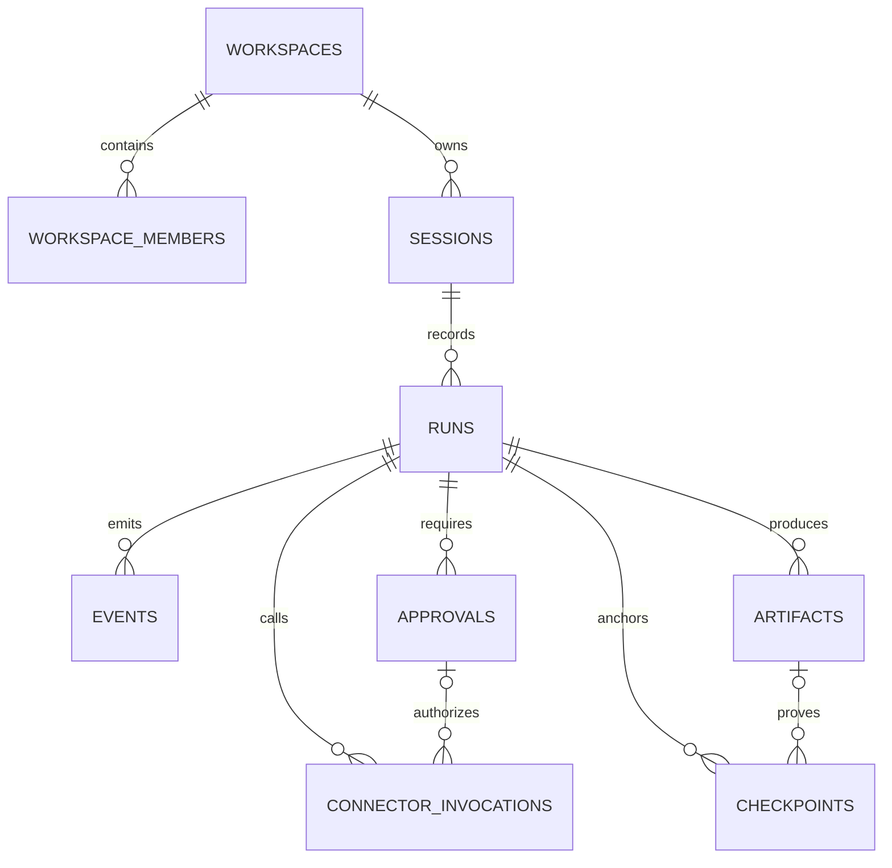

# Execution Canvas database architecture

## Decision

Use PostgreSQL/Supabase as an optional server-side audit/control-plane store. Keep VS Code's existing local session persistence authoritative for native UX until the database adapter is implemented and verified. The frontend must not connect directly to these tables.

## Entities

- `workspaces`, `workspace_members`: tenancy and operator roles.
- `sessions`: external Chat session reference.
- `runs`: one execution attempt with target node and Git state.
- `events`: append-only lifecycle trace for Observe → Diagnose → Patch → Verify → Commit.
- `approvals`: explicit authorization evidence.
- `connector_invocations`: operation metadata and request/response digests; never raw secrets.
- `artifacts`: immutable references and SHA-256 evidence for logs, diffs, reports, screenshots.
- `checkpoints`: commit/rollback anchors.

## Security boundary

- Dedicated `execution` schema; no `anon` or `authenticated` access.
- RLS enabled as defense in depth; no browser policies are created.
- Only the trusted backend/service role receives schema access.
- Connector payloads are represented by digests and sanitized metadata.
- `events` rejects UPDATE and DELETE to preserve audit chronology.
- Service-role credentials must never be bundled into the Electron renderer or prototype.

## ERD



## Rollout gates

1. Apply only to a Supabase development branch or local database.
2. Run migration and verify all constraints, grants, RLS state, and append-only trigger.
3. Run Supabase security and performance advisors.
4. Generate TypeScript types and implement a backend-only adapter.
5. Dual-write behind a disabled-by-default feature flag; local persistence remains source of truth.
6. Compare event counts, sequence continuity, digests, and checkpoint recovery.
7. Enable read path only after parity and failure-injection tests pass.
8. Production migration requires backup, rollback rehearsal, and retention policy.

## Verification SQL

```sql
select schemaname, tablename, rowsecurity
from pg_tables
where schemaname = 'execution'
order by tablename;

select grantee, table_name, privilege_type
from information_schema.role_table_grants
where table_schema = 'execution'
order by grantee, table_name, privilege_type;

select indexname, indexdef
from pg_indexes
where schemaname = 'execution'
order by indexname;
```

Expected: every table has `rowsecurity = true`; browser roles have zero table grants; only intended server-side roles appear.

## Connector policy

- Supabase: operational database and migration/advisor authority.
- GitHub: migration source of truth and review history.
- Notion: decisions, rollout gates, and evidence links only.
- Airtable: no operational copy; connector returned no bases and duplicating canonical state would create drift.
- DataCamp: reference/training material only, never runtime data.
